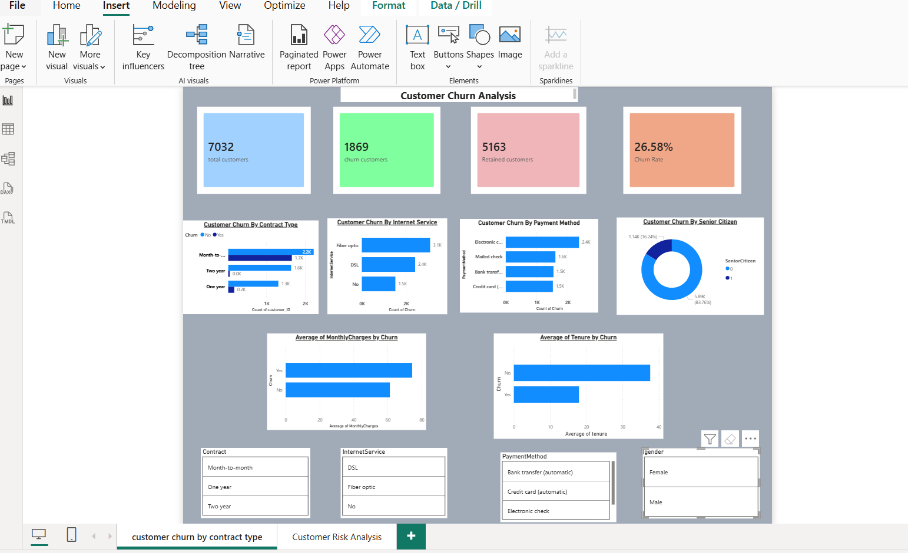
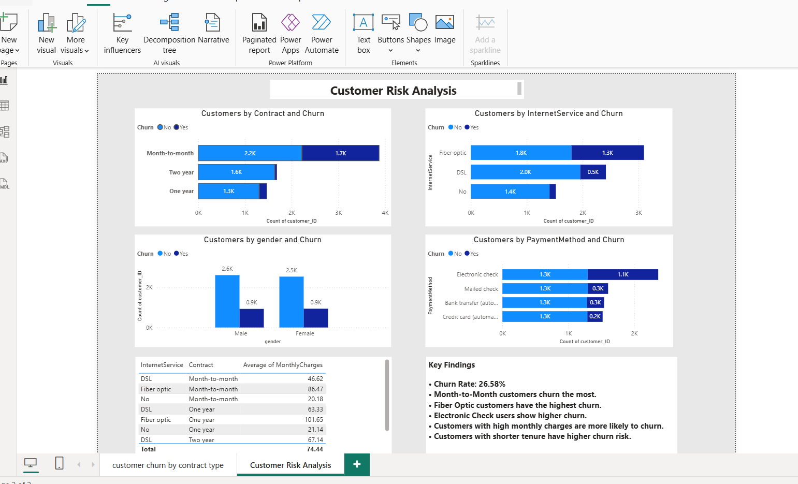

# 📊 Customer Churn Analysis Using SQL & Power BI

## 📌 Project Overview

This project analyzes customer churn data using **MySQL and Power BI** to identify the key factors associated with customer churn and customer retention.

The project combines **SQL-based data analysis** with an interactive **Power BI dashboard** to transform raw customer data into meaningful business insights and actionable recommendations.

---

## 🎯 Business Objective

The main objective of this project is to:

* Understand the overall customer churn rate.
* Identify customer segments with higher churn levels.
* Analyze how contract type affects churn.
* Understand the relationship between tenure and churn.
* Analyze churn across different internet services and payment methods.
* Identify high-risk customer segments.
* Create an interactive Power BI dashboard for business analysis.
* Provide data-driven recommendations to improve customer retention.

---

## 🔍 Business Questions

The following business questions were analyzed:

1. What is the total number of customers?
2. What is the overall customer churn rate?
3. How does gender relate to customer churn?
4. Which contract type has the highest churn?
5. How do monthly charges relate to customer churn?
6. How does customer tenure relate to churn?
7. Which internet service has the highest churn?
8. Which payment method has the highest churn?
9. How does churn vary among senior citizens?
10. Which customer segments have higher churn risk?

---

## 📂 Dataset

**Dataset Name:** Customer Churn Dataset

**Dataset File:** `customer_churn.csv`

**Total Customers:** 7,032

The dataset contains information related to:

* Customer demographics
* Customer tenure
* Contract details
* Internet services
* Payment methods
* Monthly charges
* Billing information
* Customer churn status

---

## 🛠️ Tools & Technologies

* **MySQL** – Data cleaning, EDA, and advanced SQL analysis
* **Power BI** – Interactive dashboard and data visualization
* **Excel** – Dataset inspection and supporting analysis
* **GitHub** – Project version control and portfolio presentation

---

## 🧹 Data Cleaning & Preprocessing

The following data-cleaning tasks were performed using SQL:

* Checked for missing/null values
* Checked for duplicate records
* Verified data types
* Renamed columns where required
* Reviewed customer and service-related fields
* Prepared the dataset for exploratory analysis

---

## 📊 Analysis Performed

### 1. Customer Overview

* Total customer count
* Churned customers
* Retained customers
* Overall churn rate

### 2. Customer Demographics

* Gender vs Churn
* Senior Citizen vs Churn

### 3. Contract Analysis

* Churn by Contract Type
* Comparison of Month-to-Month, One-Year, and Two-Year contracts

### 4. Service Analysis

* Internet Service vs Churn
* Customer churn across different service categories

### 5. Billing & Payment Analysis

* Monthly Charges Analysis
* Payment Method vs Churn
* Electronic Check customer analysis

### 6. Tenure Analysis

* Customer tenure and churn relationship
* Identification of customers with shorter tenure

### 7. Customer Risk Analysis

* Identification of high-risk customer segments
* Combined analysis of multiple churn-related factors

---

## 🧮 Advanced SQL Analysis

The project uses the following SQL concepts:

* `CASE` Statements
* Aggregate Functions
* `GROUP BY`
* `HAVING`
* Subqueries
* Common Table Expressions (CTEs)
* Window Functions
* Conditional Analysis
* Combined Customer Risk Analysis

---

## 📈 Power BI Dashboard

The Power BI dashboard provides an interactive view of customer churn.

### Dashboard Features

* Total Customers KPI
* Churned Customers KPI
* Retained Customers KPI
* Churn Rate KPI
* Contract Type Analysis
* Internet Service Analysis
* Payment Method Analysis
* Senior Citizen Analysis
* Monthly Charges Analysis
* Tenure Analysis
* Interactive Slicers and Filters

---

## 💡 Key Business Insights

Based on the analysis:

* The overall customer churn rate is **26.58%**.
* Month-to-Month contract customers show the highest churn levels.
* Fiber Optic customers show the highest churn among internet service types.
* Customers with higher monthly charges show higher churn levels.
* Customers with shorter tenure show higher churn levels.
* Electronic Check users show the highest churn levels among payment methods.
* Senior Citizens show relatively higher churn levels.

---

## 💼 Business Recommendations

Based on the analysis, the following recommendations were identified:

1. Encourage Month-to-Month customers to move toward longer-term contracts through suitable retention offers.
2. Review Fiber Optic service quality, pricing, and customer experience.
3. Promote automatic and convenient payment methods.
4. Develop targeted retention programs for newer customers.
5. Monitor high-value customers with above-average monthly charges.
6. Develop targeted retention campaigns for Senior Citizen customers.
7. Use customer risk analysis to identify customers who may require early retention efforts.

---

## 📸 Dashboard Screenshots

### Dashboard Page 1



### Dashboard Page 2



---

## 📁 Project Structure

```text
Customer_Churn_Analysis/

│
├── dataset/
│   └── customer_churn.csv
│
├── sql_queries/
│   ├── 01_database.sql
│   ├── 02_cleaning.sql
│   ├── 03_eda.sql
│   └── 04_Adv_queries.sql
│
├── screenshots/
│   ├── Dashboard1.png
│   └── Dashboard2.png
│
├── Business_Insights.sql
├── Business_Recommendations.sql
├── customerchurn_dashboard.pbix
└── README.md
```

---

## ▶️ How to Run the Project

### Step 1: Download the Repository

Clone or download this GitHub repository.

### Step 2: Import the Dataset

Use the dataset located inside the `dataset` folder:

```text
customer_churn.csv
```

### Step 3: Run SQL Queries

Open MySQL Workbench and execute the SQL files in the following order:

```text
01_database.sql
02_cleaning.sql
03_eda.sql
04_Adv_queries.sql
```

### Step 4: Open the Power BI Dashboard

Open:

```text
customerchurn_dashboard.pbix
```

Explore the dashboard using the available filters and slicers.

---

## 📌 Project Type

**Data Analytics | Customer Churn Analysis | SQL | Power BI**

---

## 👨‍💻 Author

**Sumit Juwar**

BCom Computer Application Student
Aspiring Data Analyst

**Skills:** SQL | Power BI | Python | Pandas | Excel | Data Analytics
